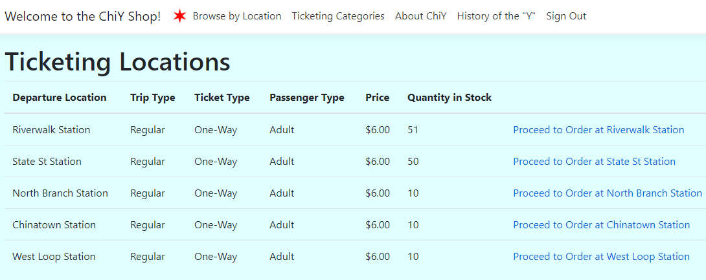
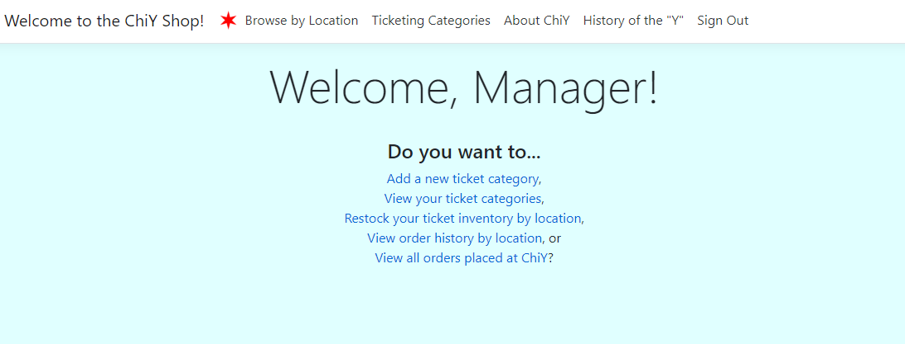

# ChiY: Store Application

## Project Description

This application is designed with functionality that would make virtual shopping much simpler! Customers can sign up for an account, place orders, view their order history, and specific location inventory. It also comes with an additional interface for managing your business. Managers can view and replenish location inventory, add new products, and view the order history of specific locations. This application used Entity Framework Core to connect to a PostgreSQL database, ASP.NET Core API to create a RESTful API, and HTML, CSS, BootstrapJS, and Javascript to create the front end.

## Roles and Responsibilities

* Made ChiY store application built on Customer/Location/Order/Product model object definition.
* Created PostgreSQL database for ChiY store application from model definition with Microsoft Entity Framework Core ORM code-first approach.
* Created RESTful API performing CRUD operation on ChiY store application database with Entity Framework Core.
* Implemented Model-View-Controller design pattern to define the UI/Business Logic/Database layer in ChiY store app frontend, controller, service and repository structure.
* Built ChiY store web application with ASP.NET MVC framework view-model scaffolding and web model/database model-binding.
* Added customer order-placing functionality and manager inventory-stocking functionality to ChiY store web application with MVC controller sending HTTP requests to Web API using HttpClient.
* Performed attribute routing, client-side validation, CORS policy configuration and entity property definition with data annotations.
* Database repo functionality unit test with in-memory database in xUnit.

## Tech Stack

* C#
* PostgreSQL
* Microsoft Entity Framework Core
* ASP.NET MVC
* ASP.NET Web API
* xUnit
* REST/HttpClient

## App Functionality

* Customer Functionality:
    * The customer can sign up for an account
    * The customer can view location inventory/ticket quantity stocked
    * The customer can place his/her order at a location
    * The customer can view/sort order history

* Manager Functionality:
    * The manager can restock a location's inventory
    * The manager can view/sort a location's order history
    * The manager can add a new ticket category

## Getting Started

* Copy my project repository onto your machine using the `git clone` command
* Open `StoreBackEnd.sln` in Visual Studio, set StoreAPI as the startup project, and run the project on IIS Express server in Visual Studio on your machine
* Open `StoreFrontEnd.sln` in Visual Studio, set StoreWeb as the startup project, and run the project on IIS Express server in Visual Studio on your machine
* Note that you must first start the StoreAPI project for the StoreWeb project to work properly!

## Usage

* Customer Functionality:
    * Sign up and log in
    * Shop by ticket category/ticketing location
    * View your order history from the home page

* Manager Functionality:
    * Proceed to the app's "manager section" upon project startup
    * Follow the app's navigation to your desired action
    * View/restock ticket inventory and view/sort order history at your chosen location

## License

This project uses the following license: [MIT License](LICENSE).
